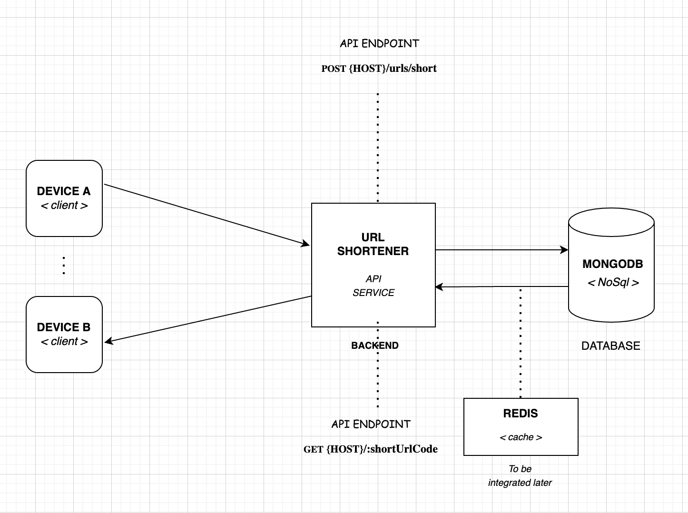

# dot-pay

### DESCRIPTION
```
URL SHORTENER IMPLEMENTATION USING TYPESCRIPT & MONGODB
```

### PROGRAMMING LANGUAGE(S)
* Typescript programming language (API implementation)

### TOOL(s) USED
* NodeJs
* MongoDB
* Jest & Supertest

### BACKEND ARCHITECTURE


### API ENDPOINTS AVAILABLE
* POST {HOST}/urls/short
* GET {HOST}/:shortUrlCode

### Testing
```
COMING SOON
```